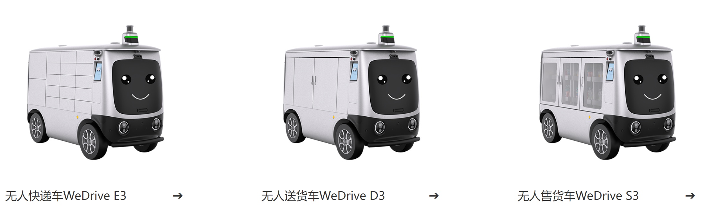
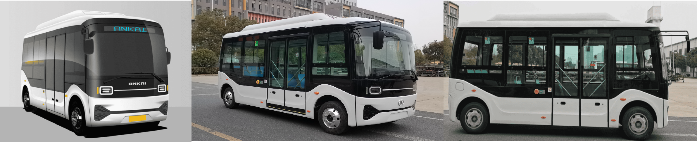
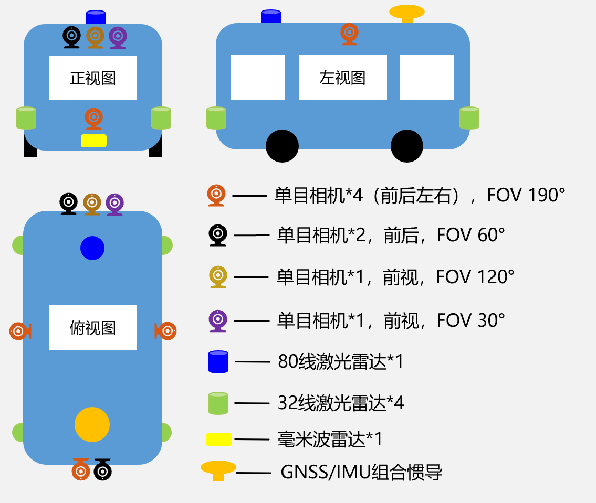

# 形智自动驾驶（SonicAutoDrive）参考硬件方案

硬件平台作为自动驾驶系统的基础，对系统的稳定性和性能至关重要。形智自动驾驶系统提供了两类硬件平台方案：一种是成熟的硬件平台，适合快速开发和部署；另一种是自行搭建的硬件平台，适合灵活定制和深入研究。以下是这两类硬件平台的详细介绍。

## 成熟硬件平台

- 成熟硬件平台可以直接购买，推荐[任我行无人车](http://www.wedrive-ai.com/index)。

  

- 以[无人售货车Wedrive S3](http://www.wedrive-ai.com/product/detail/id/15.html)为例，车辆配备了多种传感器（激光雷达、超声波雷达、相机、组合惯导）和计算单元。
- 车辆已预装Ubuntu 20.04操作系统和ROS noetic开发环境。
- 所有传感器均已配置好ROS驱动，可直接获取传感器的ROS消息。
- 开发者可基于该软硬件系统进行L4自动驾驶系统开发和部署。

| Wedrive S3 基本配置 | 详细信息                         |
|---------------------|----------------------------------|
| 车辆尺寸（mm）       | L 2500 * W 1070 * H 1820         |
| 计算单元             | Leetop-A502                      |
| 激光雷达             | 速腾16线 * 2，32线 * 1            |
| 超声波雷达           | 待补充                           |
| 相机                 | 中科慧眼双目 * 1                   |
| 组合惯导+DTU         | GNSS/IMU + RTK                   |
| 底盘                 | 中云智车                         |
| 软件系统             | Ubuntu 20.04 + ROS noetic        |

## 自行搭建硬件平台

- 采用[安凯 E6](https://www.ankai.com)作为底盘框架。安凯 E6 是一款具有高稳定性和高安全性的电动公交车，可承载人数为18人（9座位+9站立），适用于城市公共交通和其他商业用途。基于该车辆，设计一整套的传感器、计算单元等硬件方案，用于形智自动驾驶的开发、系统部署与应用。

  

### 硬件方案

- 传感器方面，配备四个32线激光雷达分别位于车辆左前、右前、左后、右后方，以及一个80线激光雷达位于车辆前上方。
- 相机包括四个水平FOV为190°的相机，分别位于前后左右，两个水平FOV为60°的相机位于前后方，另有FOV 120°和FOV 30°的相机用于前方视野和远距离视野。
- 车辆下方配备一台毫米波雷达用于冗余补充。
- 定位方面采用广州导远电子INS 570D的组合惯导设备，位于车辆后上方。
- 传感器的部署位置示意图如下：

  

| 参考硬件平台 | 详细信息                          | 用途 |
|---------------------|------------------------|-----------|
| 车辆尺寸（mm）       | L 5990 * W 2070 * H 2850          | |
| 计算单元             | 宸曜 Nuvo-10108GC                  | 自动驾驶系统运行 |
| 激光雷达             | 速腾32线 * 4，80线 * 1             | 3D感知 |
| 毫米波雷达           | 德国大陆 ARS 408-21 * 1           | 感知补充 |
| 相机                 | 森云智能 * 8 (4+2+1+1)             | 视觉感知 |
| 定位设备（组合惯导+DTU）| 广州导远电子 INS 570D               | 车辆定位 |
| 时间同步盒           | 星旗 XQ-500                       | 传感器时间同步 |
| 安全网关             | 云驰未来 D2000                    | 车辆外部网络服务 |
| 工业交换机           |  TP-LINK TL-SG2216               | 车辆内部网络服务 |
| 底盘                 | 安凯 E6                           | 线控 |
| 车载OBU              | 海康智联OBU                        | 智能网联 |
| 其他配件              | 鼠标、键盘、显示器、风扇、开关等      | 系统操作 |
| 软件系统             | Ubuntu 20.04 + ROS noetic         | 基础系统 |

### 传感器方案

- 在传感器选型方面，特别是激光雷达和相机的选择，团队从安全性和覆盖率两个方面进行了详细的方案设计，具体内容参见[传感器选型方案](2_HW_传感器设计方案.md)。

### 硬件集成方案

- 在传感器与硬件选型结束后，需要结合车辆型号与尺寸，设计硬件集成方案，包括明确各设备的供电、功率情况、设备间接口与连接情况、安装位置与结构等一系列内容，具体内容见[硬件集成方案](3_HW_硬件集成方案.md)。

### 传感器时间同步方案
- 在自动驾驶系统中，各类传感器的精确同步对于实现可靠的性能和安全至关重要。通过综合考虑不同传感器的接口和线束要求，我们设计了一套完善的传感器同步方案，旨在确保所有传感器能够在同一时间框架内协调工作，提高数据采集的精确度和系统的响应速度，具体内容见[传感器时间同步方案](4_HW_传感器时间同步方案.md)。
