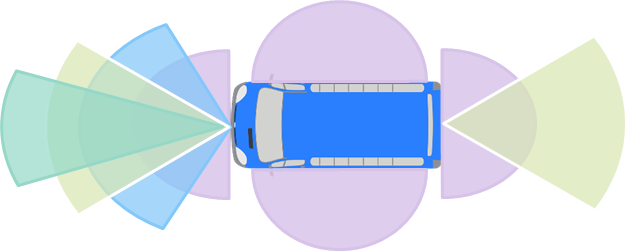

# 形智自动驾驶（SonicAutoDrive）传感器方案

在传感器选型方面，一方面考虑传感器的通用性，另一方面也考虑应用场景的安全性。形智自动驾驶系统针对巴士，精心设计了一套详尽的传感器选型方案，以确保系统在各种复杂环境中的可靠运行和高效性能。

## 相机

- 针对无人巴士，为保障车辆周围360°视野覆盖，并考虑到实际应用，选择了8个不同视野范围的相机安装在车辆周围。

<!-- 

  

 -->

- 8个相机对应的安装位置示意图与型号如下。

<!-- 

  

 -->

| 位置       | 用途         | 型号                         | 水平视场 |
|------------|--------------|------------------------------|----------|
| 前视8M-60° | 红绿灯       | [SG8S-AR0820C-5300-G2A-H60SA](https://autosensee.feishu.cn/file/EeaDbepKFodUflx2Eqic0eNznwf?from=from_copylink) | 60       |
| 前视8M-30° | 远距离       | [SG8S-AR0820C-5300-G2A-H30YA](https://autosensee.feishu.cn/file/EsxEbsOL7om4MAx77b7cBTh6nDc?from=from_copylink) | 30       |
| 前视8M-120°| 前方障碍物   | [SG8S-AR0820C-5300-G2A-H120YA](https://autosensee.feishu.cn/file/Rj1fb8ubMolBhrxdxa5cyyUIn5c?from=from_copylink) | 120      |
| 后视3M-60° | 车身后方     | [SG3S-ISX031C-GMSL2F-H60FA](https://autosensee.feishu.cn/file/G5LKbEL0ioF6gSxRnMAceTGWnBc?from=from_copylink)   | 60       |
| 环视-前视3M-190° |  前视    | [SG3S-ISX031C-GMSL2F-H190XA](https://autosensee.feishu.cn/file/ISxtbAyHAo4lPLx65xrcp0Ulndd?from=from_copylink)  | 196      |
| 环视-左右侧视3M-190°*2| 车身左右障碍物 | [SG3S-ISX031C-GMSL2F-H190XA](https://autosensee.feishu.cn/file/ISxtbAyHAo4lPLx65xrcp0Ulndd?from=from_copylink)  | 196      |
| 环视-后视3M-190°   |   后视   | [SG3S-ISX031C-GMSL2F-H190XA](https://autosensee.feishu.cn/file/ISxtbAyHAo4lPLx65xrcp0Ulndd?from=from_copylink)  | 196      |

- SG8S-AR0820C-5300-G2A-Hxxx系列尺寸如下。

<!-- 

  

 -->

- SG3S-ISX031C-GMSL2F-Hxxx系列尺寸如下。

<!-- 

  

 -->

## 激光雷达

- 针对无人巴士，为保障车辆周围360°视野覆盖，并考虑到实际应用，选择了5个不同视野范围的激光雷达安装在车辆周围。选择[速腾Robosense](https://www.robosense.ai/index)作为激光雷达供应商。

<!-- 

  

 -->

- 5个激光雷达对应的安装位置示意图与对应的型号如下。

<!-- 

  

 -->

| 位置       | 用途         | 型号                         | 
|------------|--------------|------------------------------|
| 车顶360° 80线 * 1 | 远距离环视    | 速腾Robosense RS-Ruby-80 |
| 前后左右 32线 * 4 | 近距离       | 速腾Robosense RS-Helios-32 |

## 其他传感器

- 除了相机与激光雷达外，还为车辆配备了必要的毫米波、组合惯导传感器，用于提供感知冗余以及车辆的定位信息，具体的选型如下。

| 其他传感器 | 详细信息                          |
|---------------------|-----------------------------------|
| 毫米波雷达           | 德国大陆ARS 408-21 * 1           |
| 组合惯导             | 广州导远电子INS 570D               |
