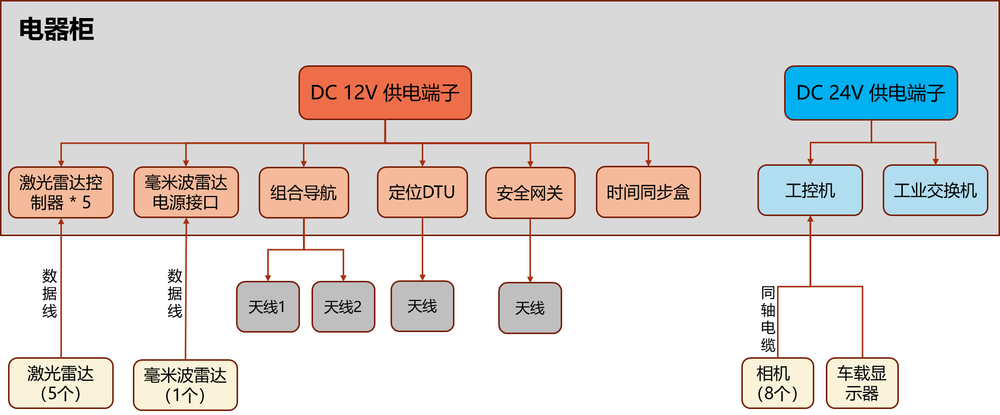
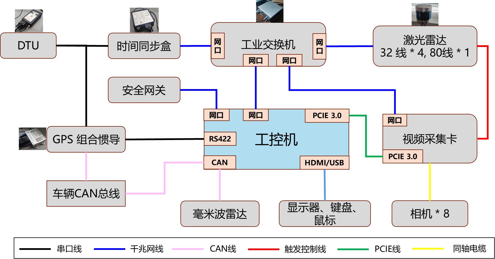
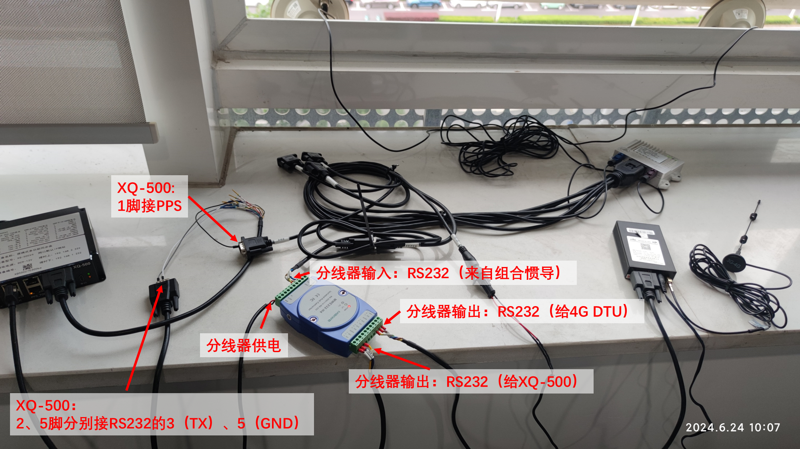

# 形智自动驾驶（SonicAutoDrive）硬件集成方案

在形智自动驾驶自动驾驶车辆的硬件集成方案中，综合考虑车辆型号与尺寸，精心设计传感器和硬件组件的供电、功率管理、接口连接、安装位置及其结构。这一方案旨在确保硬件的高效集成与系统整体的最优性能，同时满足车辆的安全性和可靠性标准。

## 车辆硬件列表

| 参考硬件平台 | 详细信息                          | 用途 |
|---------------------|------------------------|-----------|
| 计算单元（工控机）     | 宸曜 Nuvo-10108GC                  | 自动驾驶系统运行 |
| 激光雷达             | 速腾32线 * 4，80线 * 1             | 3D感知 |
| 毫米波雷达           | 德国大陆 ARS 408-21 * 1           | 感知补充 |
| 相机                 | 森云智能 * 8 (4+2+1+1)             | 视觉感知 |
| 定位设备（组合惯导+DTU）| 广州导远电子 INS 570D               | 车辆定位 |
| 时间同步盒           | 星旗 XQ-500                       | 传感器时间同步 |
| 安全网关             | 云驰未来 D2000                    | 车辆外部网络服务 |
| 工业交换机           |  TP-LINK TL-SG2216               | 车辆内部网络服务 |
| 底盘                 | 安凯 E6                           | 线控 |
| 车载OBU              | 海康智联OBU                        | 智能网联 |
| 其他配件              | 鼠标、键盘、显示器、风扇、开关等      | 系统操作 |
| 软件系统             | Ubuntu 20.04 + ROS noetic         | 基础系统 |

## 供电与功率管理

- 详细规划各硬件设备的电源需求，确保电源系统的稳定性和冗余设计，以适应不同工况下的需求。

- 根据选型的传感器与硬件设备，分为DC 12V供电设备与DC 24V供电设备，功率合计约为1642W，具体如下。

| 电压   | 总功率    | 设备           | 功率      |
|--------|----------|----------------|-----------|
| DC 12V | 共382W   | 毫米波雷达      | 12W       |
|        |          | 32线激光雷达    | 40W*4     |
|        |          | 80线激光雷达    | 40W*1     |
|        |          | 定位设备+DTU   | 20W       |
|        |          | 安全网关        | 30W       |
|        |          | 时间同步盒      | 10W       |
|        |          | 散热风扇        | 15W*2     |
|        |          | 车载OBU         | 20W       |
|        |          | 预留           | 30W*2     |
| DC 24V | 共1260W  | 工控机          | 1000W     |
|        |          | 交换机          | 20W       |
|        |          | 预留           | 120W*2    |
| 总计   | 共1642W  |                |           |

<!-- 

  

 -->

- 上述硬件在电器柜中连接关系如下。

<!-- 

  

 -->

## 设备间数据连接

### 设备连接示意图

- 各传感器与工控机网络连接关系如下图所示。交换机作为数据传输的中枢设备，与工控机、视频采集卡、时间同步盒、激光雷达、安全网关通过千兆网线进行数据交换，定位设备（组合惯导）则通过对应信号协议的串口线分别与工控机和时间同步盒相连。同时，由于激光雷达能够输出3.3V的触发控制信号，因此通过定制的触发控制线与视频采集卡相连。

<!-- 

  

 -->

- 其中，各个传感器与时间同步盒子的实物连接图及各个接口的说明如下图所示。

<!-- 

  

 -->

### 设备连接接口

- 接口要求

| 设备      | 接口类型      | 数量        |
|-----------|---------------|-------------|
| 交换机    | 网口          | 4           |
| 网关      | 网口          | 1           |
| 工控机    | CAN口         | 2           |
|           | PCIe 3.0      | 1           |
|           | 网口          | 2           |

- 线束长度要求

| 设备          | 连接位置                         | 线束类型 | 线束长度 (mm)          | 计算过程                                  |
|---------------|----------------------------------|----------|-----------------------|-------------------------------------------|
| 32线激光雷达  | 前侧两个到控制台里的交换机       | 网线     | 7125                  | 4220 + 855 + 2070                         |
| 32线激光雷达  | 后侧两个到控制台里的交换机       | 网线     | 2925                  | 855 + 2070                                |
| 80线激光雷达  | 到控制台里的交换机               | 网线     | 11060                 | 885 + 4220 + 2850 + 1035 + 2070           |
| 毫米波雷达    | 到工控机                         | CAN线    | 8180                  | 1035 + 855 + 4220 + 2070                  |
| 采集卡        | 内部连接                         | 网线     | 无需考虑              | 内部连接，无需考虑                        |
| 采集卡        | 内部连接                         | PCIe线   | 无需考虑              | 内部连接，无需考虑                        |
| 网关          | 到工控机                         | 网线     | 1000                  | 配有特殊网线（泰科TE接口），需转换器      |
| 定位设备      | 天线到主机                       | 天线线束 | 5000, 10000, 20000     | 标准长度为5米，有5、10、20米规格          |
| 定位设备      | RS422线束                        | RS422    | 1500                  | 自带1500mm                                |
| 定位设备      | CAN线                            | CAN线    | 1500                  | 自带1500mm                                |
| 定位设备      | PPS时间同步网线                  | PPS网线  | 1500                  | 自带1500mm，需与工控机较近                |
| 车辆总线      | 到工控机                         | CAN线    |                   |             |

- 线束汇总

| 线束种类  | 总数量 | 规格（长度m*数量）                   | 
|-----------|--------|---------------------------------------|
| RJ45网线  | 6      | 10m * 2, 5m * 2, 1m * 1, 12m * 1      |
| CAN线     | 2      | 10m * 1, 工控机到CAN总线*1              |
| PCIe线    | 1       |         |