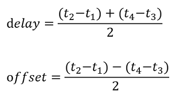

# 形智自动驾驶（SonicAutoDrive）传感器时间同步方案

在形智自动驾驶车辆的传感器时间同步方案中，通过时间同步盒和PTP时间同步技术来实现传感器之间的时间同步。

## 技术原理
时间同步的目的是使得不同设备之间共享计时标准。EE1588协议，又称PTP（precise time protocol，精确时间协议），可以达到亚微秒级别时间同步精度，于2002年发布version1，2008年发布version2。IEEE1588 协议的同步原理，所提出的Delay Request-Response Mechanism（延时响应机制），如下图所示，同步对象包括主时钟和从时钟，主时钟提供基准时间，从时钟通过与主时钟之间的通信，确定二者之间的时间偏差。

  

### PTP报文类型

- **Sync同步报文**：主时钟周期性发出，携带发送时间信息。
- **Follow_up跟随报文**：主时钟发送，包含Sync报文的精确发送时间。
- **Delay_req延迟请求报文**：从时钟发出，请求主时钟的时间信息。
- **Delay_resp延迟响应报文**：主时钟回应，提供精确的时间信息。

上图中所描述的PTP报文分为4种：sync同步报文、Follow_up跟随报文、Delay_req延迟请求报文和Delay_resp延迟请求响应报文。主从时钟之间存在时间偏差，偏离值就是offset，图中主从时钟之间虚线连接时刻，就是两时钟时间一致点）。图中的delay是指网络延时，即数据报文在网络中传输带来的延时。

延迟响应同步机制的报文收发流程如下：

**主时钟周期性发出sync报文**
   - 主时钟周期性发出sync报文，并记录下sync报文离开主时钟的精确发送时间 `t1`。
   - （此处sync报文是周期性发出，可以携带或者不携带发送时间信息，因为就算携带也只能是预估发送时间戳 `originTimeStamp`）

**主时钟发送Follow_up报文**
   - 主时钟将精确发送时间 `t1` 封装到Follow_up报文中，发送给从时钟。
   - （由于sync报文不可能携带精确的报文离开时间，所以我们在之后的Follow_up报文中，将sync报文精确的发送时间戳 `t1` 封装起来，发给从时钟）

**从时钟记录sync报文到达时间**
   - 从时钟记录sync报文到达从时钟的精确到达时间 `t2`。

**从时钟发出delay_req报文**
   - 从时钟发出delay_req报文并且记录下精确发送时间 `t3`。

**主时钟记录delay_req报文到达时间**
   - 主时钟记录下delay_req报文到达主时钟的精确到达时间 `t4`。

**主时钟发出delay_resp报文**
   - 主时钟发出携带精确时间戳信息 `t4` 的delay_resp报文给从时钟。

这样从时钟处就得到了t1,t2,t3,t4四个精确报文收发时间。从时钟可以通过t1,t2,t3,t4四个精确时间戳信息，得到主从时钟偏差offset和传输延时delay：

  

## 传感器连接

传感器连接见下图：

  

各个传感器设备的网络配置情况：

| 设备名称         | IP地址       | 网关           | 备注               |
|-----------------|--------------|----------------|--------------------|
| 图像采集卡       | 192.168.2.11 | -              |                    |
| 时间同步盒       | 192.168.2.222| -              |                    |
| 激光雷达网络     | 192.168.2.201| 192.168.2.1   |                    |
| 工控机网络       | 192.168.2.10 | 192.168.2.1    | enp0s4网卡         |

路由表见下图，此时工控机、采集卡和激光雷达全都能够相互ping通。

  

## PTP时间同步工具的安装

PPT时间同步的完成依赖于ptp4l算法工具，命令行安装方式：sudo apt install linuxptp，其配置文档有两个，分别位于/lib/systemd/system/ptp4l.service和/lib/systemd/system/phc2sys.service，主要修改项为下图中高亮标出的工控机网卡名。

  

配置修改完成后，系统中会出现两项基本服务：ptp4l 和 phc2sys，前者负责同步指定的网卡和PTP主时钟（XQ-500时间同步盒）的时间，后者负责同步该网卡和ubuntu系统的时间。需要手动启用这两项服务：

sudo systemctl enable ptp4l.service
sudo systemctl enable phc2sys.service
再用systemctl restart命令重启该项服务（例如sudo systemctl restart ptp4l.service），或重启工控机，之后检查该两项系统服务的状态（见下文）。

## PTP时间同步测试一：分析时间同步日志

PTP时间同步的测试在工控机上进行。利用时间同步的日志，可以检查视频采集卡与时间同步盒子的同步偏差，具体测试步骤如下：

- 首先确保各个传感器工作正常，传感器、交换机和工控机之间网络连接正常（传感器可以ping通并且可从网页端利用ip地址直接访问激光雷达和时间同步盒子的管理界面，驱动可以正常运行）

- 确保ptp4l、phc2sys系统服务正常运行（systemctl命令查看服务运行状态），如下图所示：

  

- 登录视频采集卡（命令行执行 ssh root@192.168.2.11），查看ptp同步日志（命令行执行 tail -f /data/bsplog/ptp.log），确保时间同步正常。如下图所示，红框标注出了每个同步周期内最大的绝对时间偏差，单位为纳秒，框内可见最大绝对偏差为3744纳秒，即3.744微秒。该日志是实时刷新的。

  

- 命令行切换到本地路径："cd /home/user/workspace/ws_time_sync/analysis"，然后复制视频采集卡上的时间同步日志到本地："scp root@192.168.2.11:/data/bsplog/ptp.log ./"，输入密码

- 执行python脚本: python3 log_analyze.py 1000，其中1000表示只读取ptp.log文件的最后1000行。执行结果如下："statistics of max_abs_offset (mean +/- std): 1954.079 +/- 1657.7701043145275 ns"，表示周期内最大绝对时间偏差的平均值和标准差分别为：1954.079纳秒，1657.77纳秒

## PTP时间同步测试二：rosbag文件的时间轴

PTP时间同步的测试在工控机上进行。录制传感器的ROSBAG文件，可以分析各个ROS消息事件在服务器时间轴上的分布情况、ROS消息时间戳之间的时间同步情况，这两个测试实验分别用系统时间、激光雷达点云时间作为基准，具体测试步骤如下：

- 启动相机、激光雷达的ROS驱动：传感器的ROS驱动代码存放于工控机，命令行切换到工作目录：cd /home/user/workspace/ws_sensor_drivers，然后执行：./run_all_sensors.sh，输入工控机的sudo密码，等待传感器全部启动

- 录制ROSBAG数据：命令行切换到目录 cd /home/user/workspace/data，执行如下命令录制数据 "rosbag record -b 4096 /video_0/imgs/image_raw /video_2/imgs/image_raw /video_3/imgs/image_raw /top_lidar/rslidar_points /pbox_pub/Ins --duration 10"，最后一个参数"10"代表录制数据的时长为10秒，可以自行选择时长，但是不要太长，以免ROSBAG文件过大。录下来的文件自动按照时间戳命名，例如2024-06-26-17-24-47.bag

- 执行python脚本分析rosbag文件：python3 analysis.py --bag-file 2024-06-26-17-24-47.bag --base-topic /top_lidar/rslidar_points，其中--bag-file后跟ROSBAG文件路径，--base-topic后跟激光雷达点云的话题名，执行结果如下：

  

    
- 测试结论记录如下：

  

